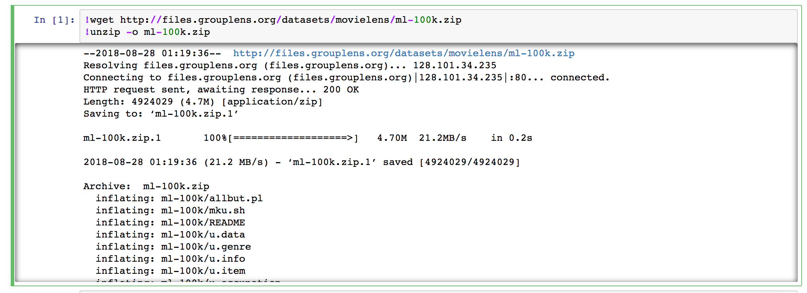
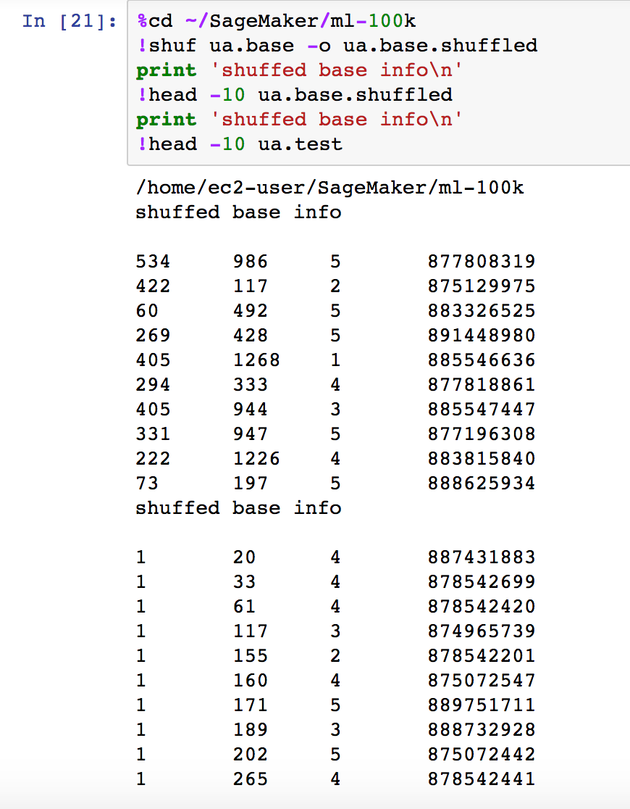
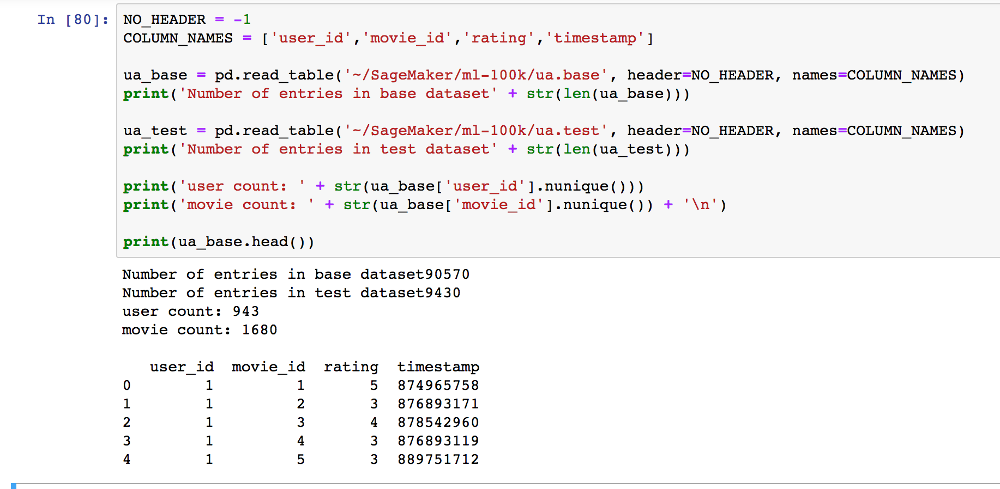
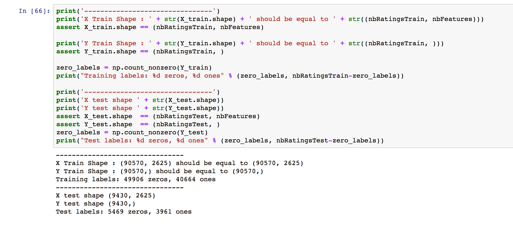
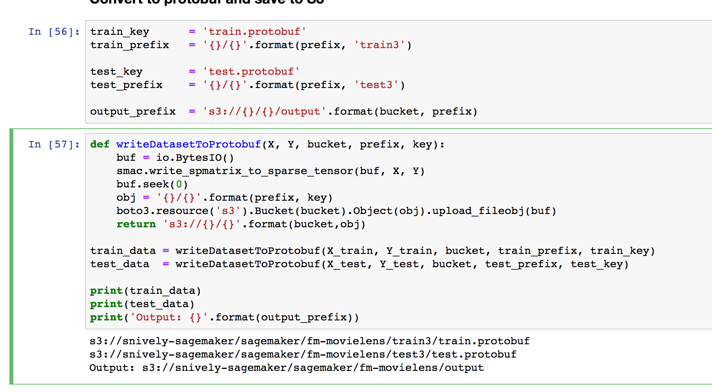
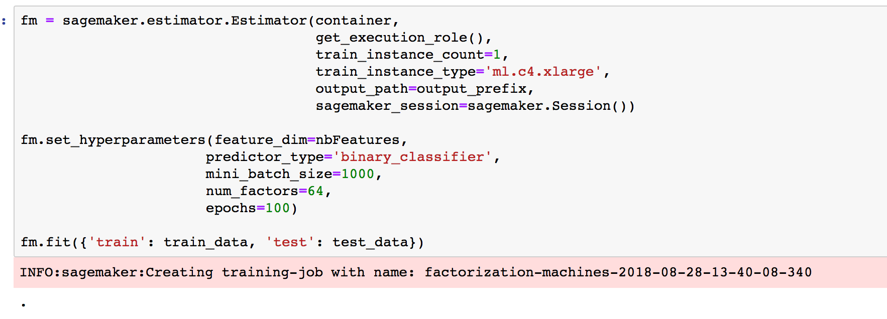
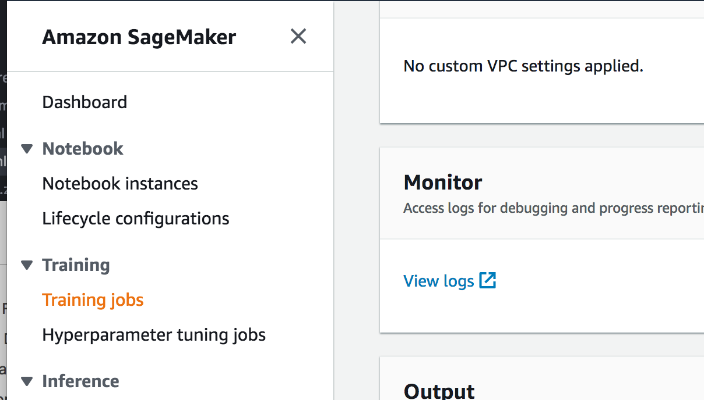
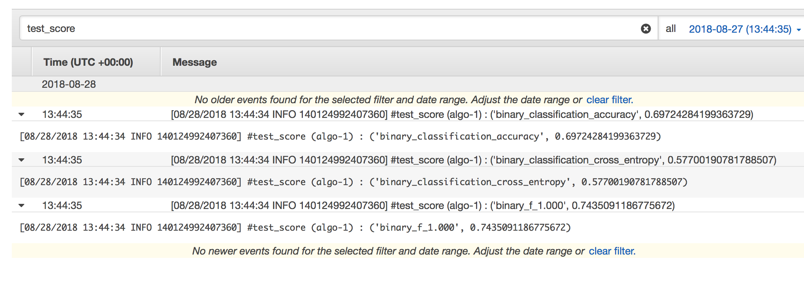

  Amazon SageMaker Workshop                              if ( $.cookie('styleCookie') === 'style-light.css') { $('html, body').css('background', '#eeeeee'); } else if ($.cookie('styleCookie') === 'style.css') { $('html, body').css('background', '#222222'); }                     

  Lab 2:  
Factorization Machines
=================================

Step 1
------

Introduction

A factorization machine is a general-purpose supervised learning algorithm that you can use for both classification and regression tasks. It is an extension of a linear model that is designed to capture interactions between features within high dimensional sparse datasets economically. For example, in a click prediction system, the factorization machine model can capture click rate patterns observed when ads from a certain ad-category are placed on pages from a certain page-category. Factorization machines are a good choice for tasks dealing with high dimensional sparse datasets, such as click prediction and item recommendation.

Step 2
------

Loading the base notebook

1.  Download the base notebook: [FactorizationMachineWorkshop.ipynb](FactorizationMachineWorkshop.ipynb)
2.  Open the notebook instance and upload the notebook
3.  First update the S3 bucket location

5.  Let's load the data and look at it:  
    Run the first cell to download the dataset to the notebook:
    
    
    
6.  The ua.base: The data sets ua.base, ua.test, ub.base, and ub.test split the u data into a training set and a test set with exactly 10 ratings per user in the test set. The sets ua.test and ub.test are disjoint. These data sets can be generated from u.data by mku.sh.  
    
    
    
7.  What if we didn't know the data set sizes, training set size, and other information  
    We can use pandas (or other methods) to investigate:
    
    
    
8.  Next, run through the next couple cell until this one. We are going to print the training and test dataset sizes that we are expecting, but also running asserts...
    
    
    

Step 3
------

Training the Factorization Machine

1.  Run the first two cells in this section. This will setup the S3 location for the training, test, and output locations
    
    
    
2.  Next, let's get the SageMaker Container for Factorization Machine in the region we are running
    
    
    
    **IMPORTANT: Notice how we are retrieving the container through a lookup. This is the preferred method**
3.  let's run the model next. Type this into the next cell It sets up the SageMaker Estimator  
    **We are passing in container we discovered via the lookup in the block prior. This is how it's knows we are doing Factorization Machine**
    
    fm = sagemaker.estimator.Estimator(container,
                 get\_execution\_role(),
                 train\_instance\_count=1,
                 train\_instance\_type='ml.c4.xlarge',
                 output\_path=output\_prefix,
                 sagemaker\_session=sagemaker.Session())
    											
    
    In the same code block ,let's set the hyperparamters and fit/train the model:
    
    fm.set\_hyperparameters(feature\_dim=nbFeatures,
                          predictor\_type='binary\_classifier',
                          mini\_batch\_size=1000,
                          num\_factors=64,
                          epochs=100)
    
    fm.fit({'train': train\_data, 'test': test\_data})
    										
    
    Run the cell to kick off the training job. You'll see the output on the cell print the status of the job.
    
    
    
4.  After a couple minutes, you'll see the training job kick off (under the covers we use docker):
    
    
    
5.  Let's look at some fo the logging of the training  
    Go to the SageMaker console under the "training jobs" menu  
    Select the job you are running and select "logs" under the details:
    
    
    
      
    
6.  Select the factorization machine log group and search for test\_score metrics:
    
    
    

Step 4
------

Deploying the model endpoint

1.  Deploy the model. This can take a few minutes...
    
    
    
2.  Define the serializition and the predict the models
    
    
    

© 2018, Amazon Web Services, Inc. or its affiliates. All rights reserved.
