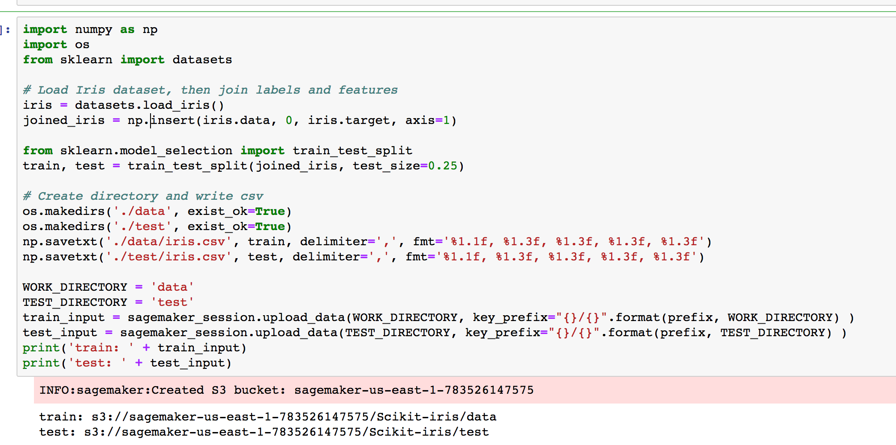
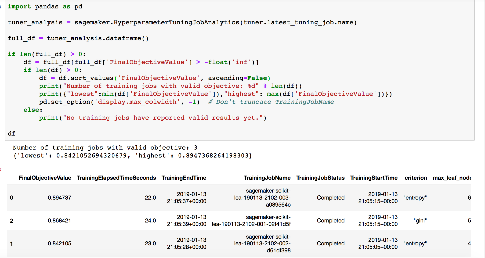
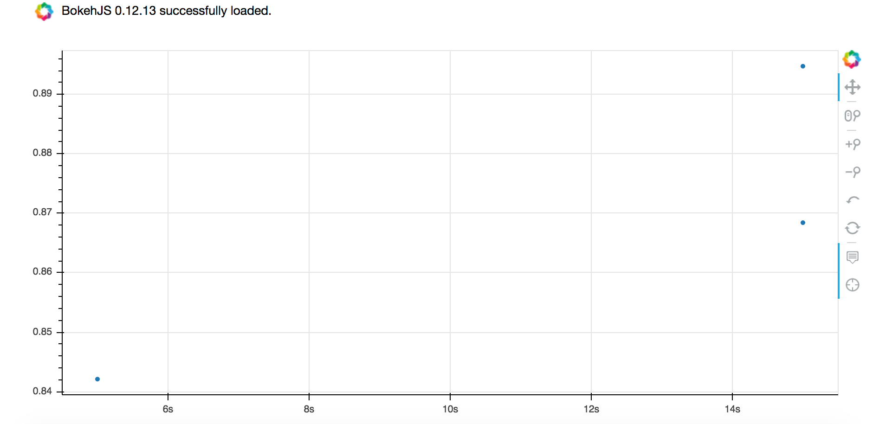
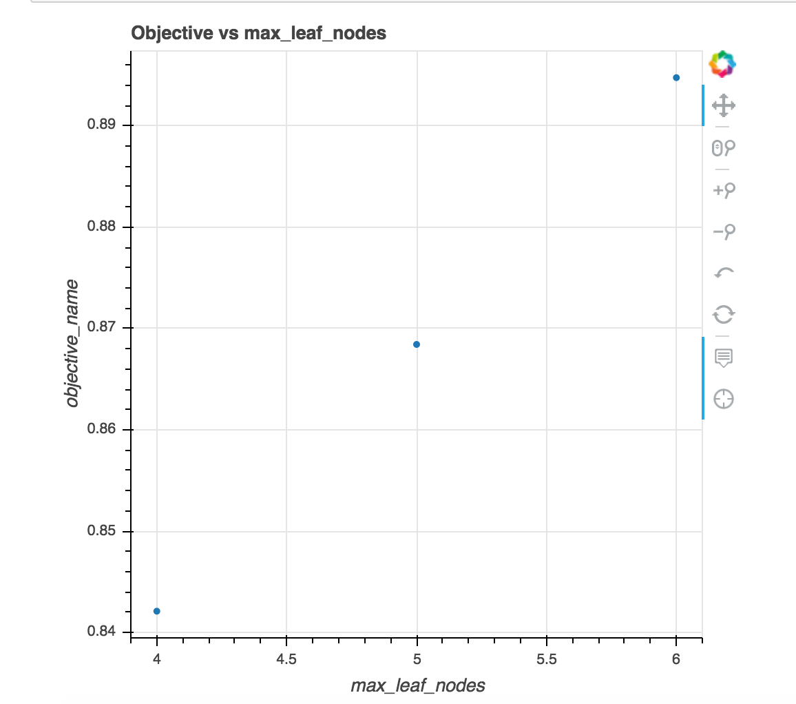
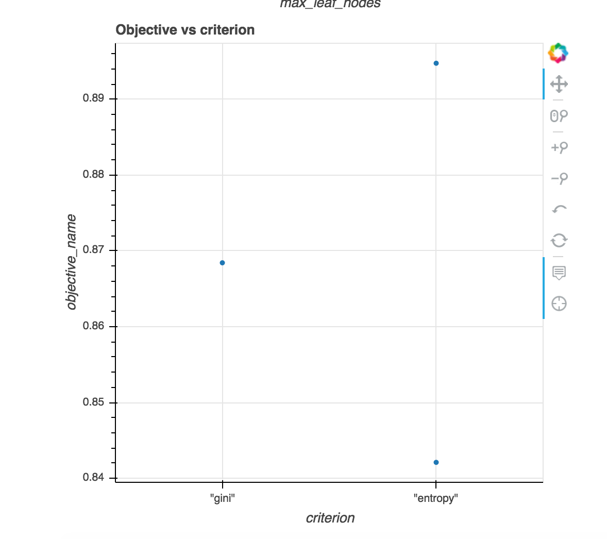
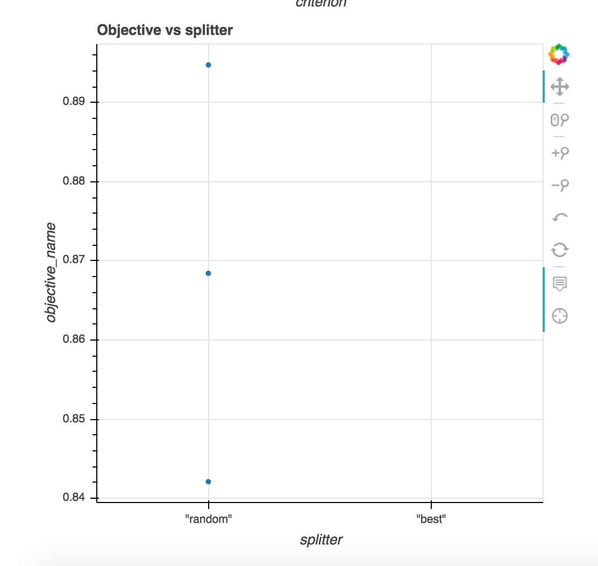

Amazon SageMaker Workshop                              if ( $.cookie('styleCookie') === 'style-light.css') { $('html, body').css('background', '#eeeeee'); } else if ($.cookie('styleCookie') === 'style.css') { $('html, body').css('background', '#222222'); }                     

Lab 3:  
HPO for SciKit Learn on SageMaker
============================================

Step 1
------

Introduction

Hyperparameter tuning is a supervised machine learning regression problem. Given a set of input features (the hyperparameters), hyperparameter tuning optimizes a model for the metric that you choose. You can choose any metric that the algorithm you use defines. To solve a regression problem, hyperparameter tuning makes guesses about which hyperparameter combinations are likely to get the best results, and runs training jobs to test these guesses. After testing the first set of hyperparameter values, hyperparameter tuning uses regression to choose the next set of hyperparameter values to test.

Step 2
------

Creating our HPO Job

1.  Select the 03\_HPO\_with\_SciPi.ipynb notebook

  

2.  Let's look at the notebook We'll setup the same dataset and Estimator as before  

  Normally you'll have these defined once in a single notebook or python file but we define it again here to be explicit and for readers to see exactly what needs to be defined.  

  Run the first cell that defines the role
3.  Just as before, let's setup the dataset used for each of the training jobs that our HPO will kick off

  

4.  The next cell defines a few critical things:

  *   The estimator that each job will use, we are using scikit

      

  *   The Hypterpameter range that our HPO job should use as it kicks off various jobs:

      

  *   Finally, our objective metric, which tells us how well the model performs, and how many parrallel and total jobs to run

      

  The last part of this cell, which you should go ahead and execute, starts the HPO job:

  

5.  Kick off the job, you should see a message that it's saying it's starting:

  

Step 3
------

Evaluting the HPO Job

1.  Let's see how we can pull the tuning job name into the parameter and wait for it to finish now in the next two cells:

  

2.  We can start analyzing the results of the jobs:

  

3.  First lets look at our training objective score over time

  

4.  Now let's look per objective, the training objective

  

  

  

© 2018, Amazon Web Services, Inc. or its affiliates. All rights reserved.
