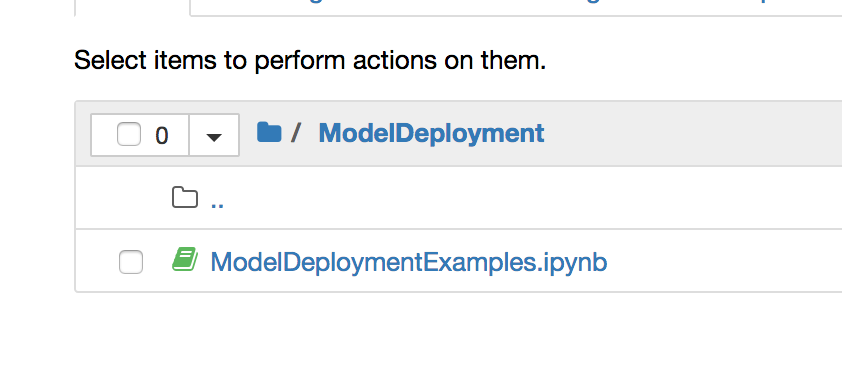
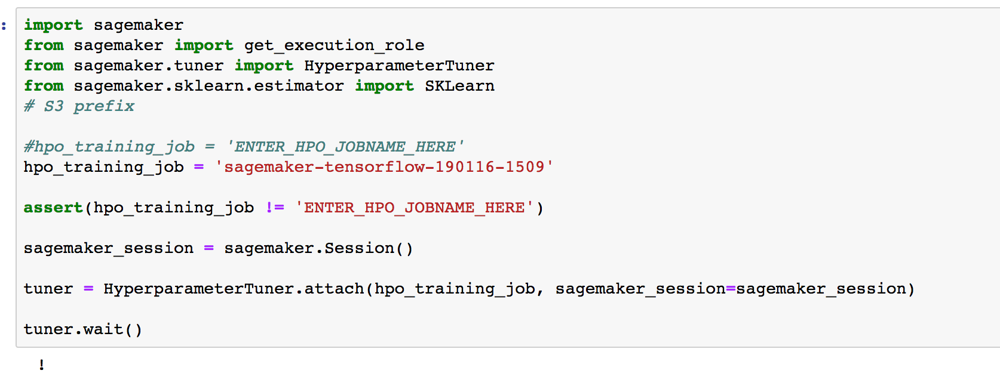
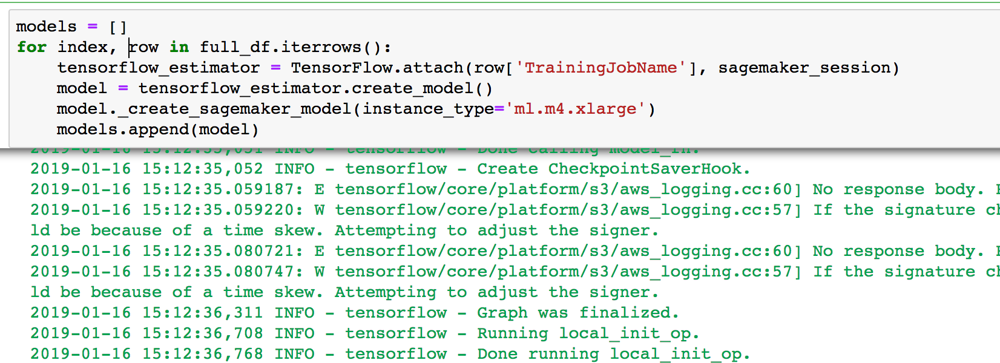
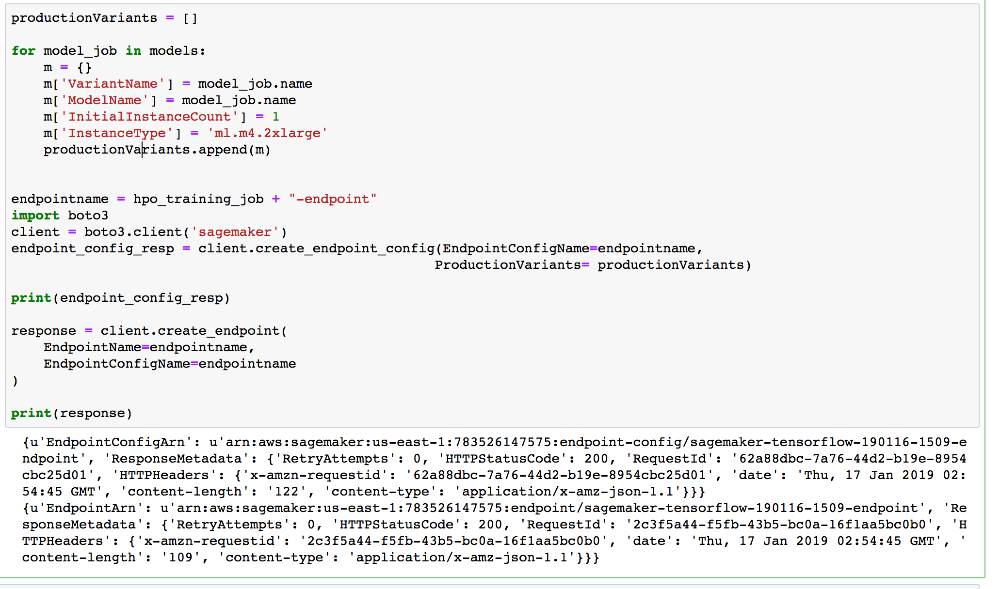
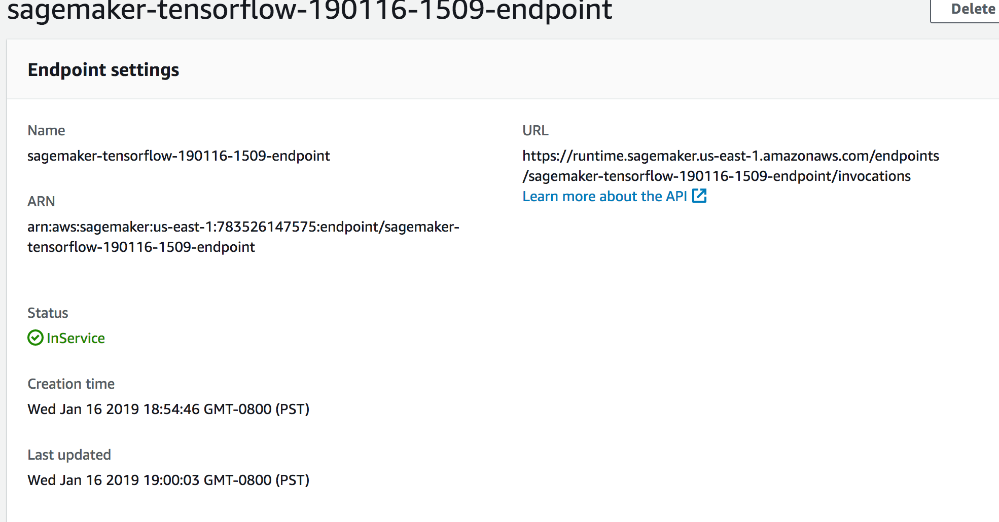

  Amazon SageMaker Workshop                              if ( $.cookie('styleCookie') === 'style-light.css') { $('html, body').css('background', '#eeeeee'); } else if ($.cookie('styleCookie') === 'style.css') { $('html, body').css('background', '#222222'); }                     

  Lab 5:  
Deploying Models and A/B Testing
===========================================

Step 1
------

Introduction

In this section, we'll use the HPO results from Lab 1/2 and deploy the 3 models we built. Often times you'd take only the best model, but this will give us 3 models that we can deploy to and endpoint and then load balance across all three of them with various weights.

Step 2
------

Deploying our endpoint

1.  Select the ModelDeployment/ModelDeploymentExamples.ipynb notebook
    
    
    
2.  **IMPORTANT:** Replace the HPO job name with the job name from labs 1/2
    
    
    
3.  Execute the next cell, it will wait if the tuner is still running.
    
    
    
4.  We can use the Tuning Analytics to pull a dataframe that contains the various tuning jobs. We'll use these 3 jobs we ran earlier to push out an endpoint that has 3 different models behind it.
    
    
    
5.  We can loop through and create SageMaker models for each of the jobs. We need to do this in order to have SageMaker back the model behind the endpoint
    
    
    
6.  The next cell will now create an endpoint configuration with equal weights across all three models, and then create and endpoint w/ that configuration
    
    
    
7.  If you look in SageMaker under Endpoint Configurations, you can see the three models configured under the endpoint you just created.
    
    
    
8.  If you look in SageMaker under Endpoint Configurations, you can see the three models configured under the endpoint you just created.
    
    
    
9.  And you can see the endpoint itself under the "Endpoints" section
    
    
    

© 2018, Amazon Web Services, Inc. or its affiliates. All rights reserved.
